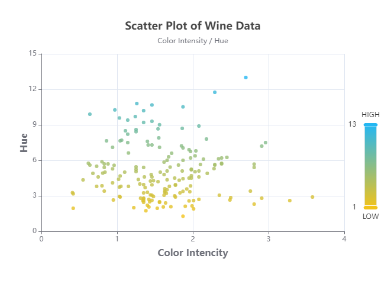
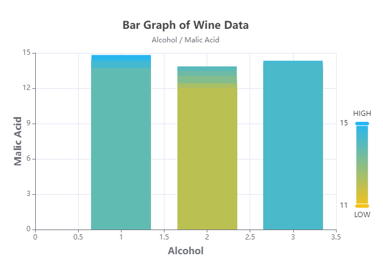

# Data Visualization Task

### Scatter Plot

### Bar Graph

## Available Scripts

In the project root directory, you can run:

### `yarn install`

Run this command to install all dependencies.

### `yarn start`

Runs the app in the development mode.\
Open [http://localhost:3000](http://localhost:3000) to view it in the browser.

### `yarn build`

Builds the app for production to the `build` folder.\
The build is minified and the filenames include the hashes.\
Your app is ready to be deployed!
